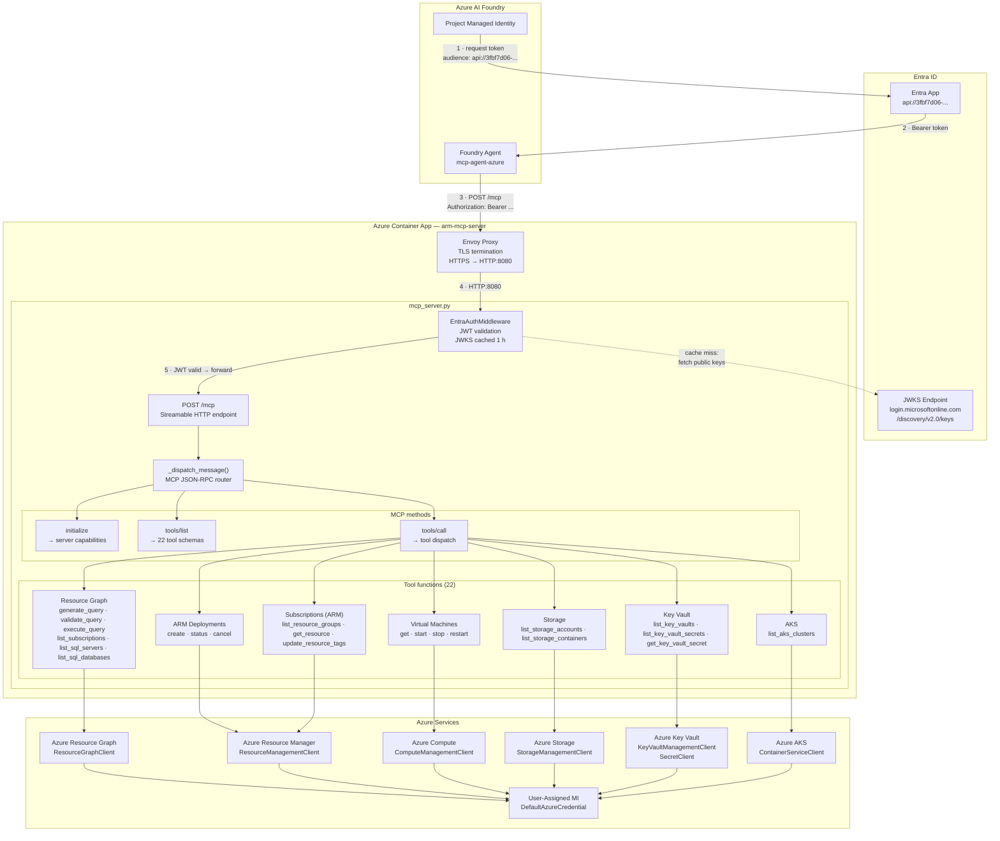

# ARM MCP Server — Azure AI Foundry Agent

A custom Python **Model Context Protocol (MCP) server** that exposes Azure Resource Manager (ARM) tools to an Azure AI Foundry agent. Deployed as an Azure Container App with Entra ID authentication.

---

## How it works

### Architecture flow diagram



### Component summary

| Component | Role |
|---|---|
| **Foundry Agent** | Sends MCP JSON-RPC requests; obtains Bearer token via its project managed identity |
| **Envoy Proxy** | Terminates TLS at the Container App ingress; forwards plain HTTP to port 8080 |
| **EntraAuthMiddleware** | Pure ASGI middleware; validates Entra Bearer tokens using cached JWKS public keys; bypassed when env vars unset (local dev) |
| **`_dispatch_message()`** | Routes JSON-RPC methods: `initialize`, `tools/list`, `tools/call`, `ping` |
| **Tool functions (22)** | `generate_query`/`validate_query` are pure Python; SQL and subscription tools use Resource Graph; VM/Storage/Key Vault/AKS use dedicated Azure SDK clients |
| **DefaultAzureCredential** | Picks up the container's user-assigned MI (`AZURE_CLIENT_ID`) for all Azure SDK calls |

### MCP tools exposed

| Namespace | Tools | Description |
|---|---|---|
| **Resource Graph** | `generate_query` | Converts natural language to Azure Resource Graph KQL |
| | `validate_query` | Checks KQL syntax |
| | `execute_query` | Runs ARG KQL queries across subscriptions |
| **ARM Deployments** | `create_template_deployment` | Deploys an ARM template |
| | `get_arm_template_deployment_status` | Polls deployment status |
| | `cancel_arm_template_deployment` | Cancels an in-progress deployment |
| **Subscriptions** | `list_subscriptions` | Lists all accessible subscriptions (via Resource Graph) |
| | `list_resource_groups` | Lists resource groups in a subscription |
| | `get_resource` | Gets full details of any resource by resource ID |
| | `update_resource_tags` | Merges tags onto any resource |
| **Virtual Machines** | `get_virtual_machine` | Gets VM details and power state |
| | `start_virtual_machine` | Starts a stopped/deallocated VM |
| | `stop_virtual_machine` | Stops and deallocates a VM (stops billing) |
| | `restart_virtual_machine` | Restarts a running VM |
| **Storage** | `list_storage_accounts` | Lists storage accounts |
| | `list_storage_containers` | Lists blob containers in a storage account |
| **Key Vault** | `list_key_vaults` | Lists key vaults |
| | `list_key_vault_secrets` | Lists secret names in a vault (not values) |
| | `get_key_vault_secret` | Gets a secret value (requires Key Vault Secrets User role) |
| **Azure SQL** | `list_sql_servers` | Lists SQL servers (via Resource Graph) |
| | `list_sql_databases` | Lists databases on a SQL server (via Resource Graph) |
| **AKS** | `list_aks_clusters` | Lists AKS clusters |

---

## Repository structure

```
├── deployment/
│   ├── mcp_server.py       # MCP server — Streamable HTTP transport + Entra auth middleware
│   ├── requirements.txt    # Python dependencies
│   └── Dockerfile          # Python 3.11-slim container, port 8080
│
└── terraform/
    ├── providers.tf          # azurerm + azuread + azapi providers
    ├── variables.tf          # All input variables (with defaults)
    ├── locals.tf             # Computed values
    ├── acr.tf                # Azure Container Registry
    ├── identity.tf           # User-assigned managed identity + AcrPull
    ├── aca.tf                # Container Apps Environment + Container App
    ├── rbac.tf               # 17 role assignments across all Azure services
    ├── foundry.tf            # Foundry project MI → Entra App role assignment
    ├── foundry_mcp_connection.tf  # MCP connection in the Foundry project
    ├── outputs.tf            # URLs, client IDs, build commands
    └── terraform.tfvars      # Your values (subscription ID, tenant ID, etc.)
```

---

## Prerequisites

Install these tools before proceeding:

| Tool | Minimum version | Install |
|---|---|---|
| [Terraform](https://developer.hashicorp.com/terraform/install) | 1.5 | `winget install Hashicorp.Terraform` |
| [Azure CLI](https://learn.microsoft.com/cli/azure/install-azure-cli) | 2.60 | `winget install Microsoft.AzureCLI` |
| [Docker Desktop](https://www.docker.com/products/docker-desktop/) | 24 | Required to build the container image locally |

Verify:

```powershell
terraform -version   # Terraform v1.5+
az --version         # azure-cli 2.60+
docker --version     # Docker 24+
```

### Required Azure permissions

Your account needs the following on the target subscription:

- **Owner** or **User Access Administrator** + **Contributor** — to create resources and role assignments

---

## Step 1 — Authenticate to Azure

```powershell
az login

# If you have multiple subscriptions, pin the correct one
az account set --subscription "0f524912-b0f4-4d41-92b2-db557f74e0e7"

# Confirm
az account show --query "{name:name, id:id, tenantId:tenantId}"
```

---

## Step 2 — Configure `terraform.tfvars`

Open `terraform/terraform.tfvars`. The file already has the correct values for the shared infrastructure. The only value you may need to set is `tenant_id` if it differs from the example:

```powershell
# Get your tenant ID
az account show --query tenantId -o tsv
```

`terraform.tfvars` reference:

```hcl
subscription_id     = "0f524912-b0f4-4d41-92b2-db557f74e0e7"
tenant_id           = "<your-tenant-id>"        # from az account show

resource_group_name = "RG_AI_Agent_MCP"         # must already exist
location            = "swedencentral"

acr_name            = "armmcpacr"               # must be globally unique, 3-50 alphanumeric

aca_name            = "arm-mcp-server"
aca_min_replicas    = 0                          # 0 = scale to zero when idle
aca_max_replicas    = 3

# Pre-provisioned Entra App — do not change these values
entra_app_client_id                   = "3fbf7d06-e265-4c2a-8abe-38184c70c6aa"
entra_app_service_principal_object_id = "8dc1ea05-0eb8-4aa6-941b-ca13e6bb4863"
entra_app_role_id                     = "38880a45-4205-421f-9c21-831a2b14b2d6"

# Existing Foundry project and storage account
foundry_project_resource_id = "/subscriptions/0f524912-.../projects/mcp-agent-azure"
storage_resource_id         = "/subscriptions/0f524912-.../storageAccounts/aimcpstorageacct"
```

> **ACR name** must be globally unique across all Azure accounts. If `armmcpacr` is taken, append a short suffix (e.g. `armmcpacr01`).

---

## Step 3 — Initialise Terraform

```powershell
cd terraform

terraform init
```

This downloads the three providers: `azurerm`, `azuread`, and `azapi`.

Expected output:
```
Terraform has been successfully initialized!
```

---

## Step 4 — Preview the deployment plan

```powershell
terraform plan -out=tfplan
```

Review the plan. You should see approximately **12 resources** to create:

| Resource | Count |
|---|---|
| `azurerm_container_registry` | 1 |
| `azurerm_user_assigned_identity` | 1 |
| `azurerm_container_app_environment` | 1 |
| `azurerm_container_app` | 1 |
| `azurerm_role_assignment` | 17 |
| `azuread_app_role_assignment` | 1 |
| `azapi_resource` (Foundry connection) | 1 |

If you see errors in `plan`, the most common causes are:

- **ACR name already taken** — change `acr_name` in `terraform.tfvars`
- **Insufficient permissions** — ensure your account has Owner/UAA on the subscription
- **Resource group does not exist** — create `RG_AI_Agent_MCP` first:
  ```powershell
  az group create --name RG_AI_Agent_MCP --location swedencentral
  ```

---

## Step 5 — Apply the infrastructure

```powershell
terraform apply tfplan
```

Type `yes` when prompted (skip if you used `-auto-approve`).

This takes approximately **3–5 minutes**. When complete, Terraform prints the outputs:

```
Outputs:

acr_login_server      = "armmcpacr.azurecr.io"
container_app_name    = "arm-mcp-server"
docker_build_command  = "az acr build --registry armmcpacr --image arm-mcp:latest ./deployment"
foundry_mcp_audience  = "api://3fbf7d06-e265-4c2a-8abe-38184c70c6aa"
foundry_mcp_endpoint  = "https://arm-mcp-server.<env>.swedencentral.azurecontainerapps.io/mcp"
mcp_endpoint          = "https://arm-mcp-server.<env>.swedencentral.azurecontainerapps.io/mcp"
health_endpoint       = "https://arm-mcp-server.<env>.swedencentral.azurecontainerapps.io/health"
```

Save these — you need them in later steps.

---

## Step 6 — Build and push the container image

The Container App was provisioned but has no image yet (it will show `Provisioning` or fail to start until the image exists). Build and push from the **repository root**:

```powershell
# From the repo root (one level above terraform/)
cd ..

# Build and push directly to ACR (no local Docker daemon needed)
az acr build `
  --registry armmcpacr `
  --image arm-mcp:latest `
  ./deployment
```

This builds the `Dockerfile` in `deployment/` inside ACR and pushes it automatically.

Expected output ends with:
```
Run ID: ca1 was successful after Xs
```

---

## Step 7 — Restart the Container App to pull the new image

```powershell
az containerapp revision restart `
  --name arm-mcp-server `
  --resource-group RG_AI_Agent_MCP `
  --revision $(az containerapp revision list `
      --name arm-mcp-server `
      --resource-group RG_AI_Agent_MCP `
      --query "[0].name" -o tsv)
```

Or force a new revision by touching the container image tag:

```powershell
az containerapp update `
  --name arm-mcp-server `
  --resource-group RG_AI_Agent_MCP `
  --image armmcpacr.azurecr.io/arm-mcp:latest
```

---

## Step 8 — Verify the server is running

```powershell
# Substitute your actual FQDN from the terraform output
$fqdn = (terraform -chdir=terraform output -raw foundry_mcp_endpoint)

# Health check — should return {"status":"ok","server":"azure-resource-manager","version":"2.0.0","tools":22}
Invoke-RestMethod "$fqdn/health"

# Check Container App logs
az containerapp logs show `
  --name arm-mcp-server `
  --resource-group RG_AI_Agent_MCP `
  --follow
```

---

## Step 9 — Connect the MCP server to your Foundry agent

The Terraform `foundry_mcp_connection.tf` creates the connection automatically. To confirm it exists:

```powershell
az rest `
  --method GET `
  --url "https://management.azure.com/subscriptions/0f524912-b0f4-4d41-92b2-db557f74e0e7/resourceGroups/RG_AI_Agent_MCP/providers/Microsoft.CognitiveServices/accounts/mcp-agent-azure/projects/mcp-agent-azure/connections?api-version=2025-04-01-preview"
```

If the `azapi` schema needs adjusting, add the connection manually in the portal:

1. Go to **[ai.azure.com/nextgen](https://ai.azure.com/nextgen)**
2. Open project **mcp-agent-azure**
3. **Build → Agent → Tools → Add → Custom → Model Context Protocol**
4. Fill in:

   | Field | Value |
   |---|---|
   | Remote MCP Server endpoint | value of `foundry_mcp_endpoint` output |
   | Authentication | **Microsoft Entra → Project Managed Identity** |
   | Audience | value of `foundry_mcp_audience` output (`api://3fbf7d06-...`) |

5. Click **Connect**

---

## Step 10 — Test from the Foundry agent

In the Foundry agent chat, try these prompts:

```
What subscriptions do I have access to?
List all resource groups in my subscription
Show all virtual machines and their power state
Start the VM named "my-vm" in resource group "my-rg"
Stop and deallocate all VMs in resource group "dev-rg"
List all storage accounts and their containers
Show all Key Vaults and list the secrets in vault "my-vault"
List all AKS clusters and their node counts
Find all Azure SQL servers and list their databases
Show all resources with the tag environment=production
```

---

## Optional — Enable On-Behalf-Of (OBO) for per-user Azure access

By default every caller (including the Foundry agent) uses the server's User-Assigned Managed Identity, so everyone sees the same subscription-wide view.

The OBO flow changes this for **human users**: instead of the server MI, the caller's own Entra identity is used to query Azure. Each person only sees the resources their own Azure RBAC allows.

> **Foundry agent (managed identity) is unaffected** — agent tokens never carry an `scp` claim, so the server always falls back to the MI path for them regardless of whether OBO is enabled.

### When to enable OBO

| Scenario | Recommended setting |
|---|---|
| Only the Foundry agent calls this server | Default (OBO disabled) — no action needed |
| Human users also call the server directly | Enable OBO so each user sees only their own resources |

### How it works

```
Human user token  (scp claim present + ENTRA_APP_CLIENT_SECRET set)
  → OnBehalfOfCredential  → Azure enforces the user's own RBAC

Foundry agent MI token  (roles claim, no scp)
  → falls back to server User-Assigned MI  → subscription-wide view
```

### Step A — Create a client secret for the Entra App

1. Go to [portal.azure.com](https://portal.azure.com) → **Azure Active Directory → App registrations**
2. Open the app with client ID `3fbf7d06-e265-4c2a-8abe-38184c70c6aa`
3. **Certificates & secrets → New client secret**
4. Set a description (e.g. `arm-mcp-obo`) and an expiry, then click **Add**
5. **Copy the secret value immediately** — it is only shown once

### Step B — Grant the API permission

1. In the same App registration, go to **API permissions → Add a permission**
2. Choose **Azure Service Management → Delegated permissions → user_impersonation**
3. Click **Add permissions**
4. Click **Grant admin consent for \<your tenant\>** and confirm

### Step C — Set the secret in Terraform and deploy

Open `terraform/terraform.tfvars` and uncomment the last line:

```hcl
entra_app_client_secret = "<paste secret value here>"
```

Apply the Terraform change (adds the secret to the Container App):

```powershell
cd terraform
terraform plan -out=tfplan   # should show ~1 change: secret + env var on the Container App
terraform apply tfplan
```

Then rebuild and push the container image to activate the updated code:

```powershell
# From the repo root
az acr build --registry armmcpacr --image arm-mcp:latest ./deployment

# Get the new image digest and update the Container App
$digest = az acr manifest list-metadata --registry armmcpacr --name arm-mcp `
  --orderby time_desc --top 1 --query "[0].digest" -o tsv

az containerapp update `
  --name arm-mcp-server `
  --resource-group RG_AI_Agent_MCP `
  --image "armmcpacr.azurecr.io/arm-mcp@$digest"
```

### Step D — Verify OBO is active

The health endpoint now reports whether OBO is enabled:

```powershell
Invoke-RestMethod "https://arm-mcp-server.politesky-a9d88b05.swedencentral.azurecontainerapps.io/health"
# Expected: { "status": "ok", "server": "azure-resource-manager", "version": "2.0.0", "tools": 22, "obo_enabled": true }
```

The startup log also confirms:

```
OBO flow     : enabled (human users get per-user Azure access)
```

### Step E — Revoke OBO (revert to MI)

Remove the secret value from `terraform.tfvars` (set back to `""`), then re-apply and rebuild.

---

## CI/CD with GitHub Actions

The repository includes a workflow at [.github/workflows/deploy.yml](.github/workflows/deploy.yml) that automates every deployment step.

### How the pipeline works

```
push to main  ──►  changes job   detect which paths changed
                       │
                       ├── terraform job   (only when terraform/** changed)
                       │     terraform init  (Azure Blob remote state)
                       │     terraform validate → plan → apply
                       │
                       └── deploy job   (when deployment/** changed OR terraform just ran)
                             az acr build  →  wait  →  get digest
                             az containerapp update @sha256:…
                             curl /health  →  assert 22 tools loaded
```

Alternatively, trigger it manually from **Actions → Deploy ARM MCP Server → Run workflow** with per-phase checkboxes.

### One-time Azure setup

Run these commands once before the first workflow execution:

```bash
# 1. Create a service principal for GitHub Actions
az ad sp create-for-rbac --name "arm-mcp-github-actions" --skip-assignment

# 2. Grant Owner on the subscription (required for rbac.tf role assignments)
az role assignment create \
  --assignee <clientId> \
  --role Owner \
  --scope /subscriptions/0f524912-b0f4-4d41-92b2-db557f74e0e7

# 3. Add a federated credential for OIDC (replace <org>/<repo>)
az ad app federated-credential create \
  --id <appObjectId> \
  --parameters '{
    "name": "github-main",
    "issuer": "https://token.actions.githubusercontent.com",
    "subject": "repo:<org>/<repo>:ref:refs/heads/main",
    "audiences": ["api://AzureADTokenExchange"]
  }'

# 4. Create the Terraform remote state container
az storage container create \
  --name tfstate \
  --account-name aimcpstorageacct \
  --auth-mode login

# 5. Grant the SP Storage Blob Data Contributor for Terraform state
az role assignment create \
  --assignee <clientId> \
  --role "Storage Blob Data Contributor" \
  --scope /subscriptions/0f524912-b0f4-4d41-92b2-db557f74e0e7/resourceGroups/RG_AI_Agent_MCP/providers/Microsoft.Storage/storageAccounts/aimcpstorageacct
```

### Required GitHub secrets

Go to **Settings → Secrets and variables → Actions** and add:

| Secret | Value |
|---|---|
| `AZURE_CLIENT_ID` | Service principal client ID (from step 1 above) |
| `AZURE_TENANT_ID` | `05764a73-8c6f-4538-83cd-413f1e1b5665` |
| `AZURE_SUBSCRIPTION_ID` | `0f524912-b0f4-4d41-92b2-db557f74e0e7` |

> No client secret is stored — the workflow uses **OIDC federated credentials** (the `id-token: write` permission) to exchange a short-lived GitHub token for an Azure access token.

### What triggers each job

| Event | Terraform job | Deploy job |
|---|---|---|
| Push — only `terraform/**` changed | Runs | Runs (new infra needs fresh image) |
| Push — only `deployment/**` changed | Skipped | Runs |
| Push — both changed | Runs | Runs |
| Manual dispatch (`run_terraform=true`) | Runs | Skipped unless `run_deploy=true` |
| Manual dispatch (`run_deploy=true`) | Skipped | Runs |

---

## Updating the server code

The easiest way is to push to `main` — the GitHub Actions workflow detects changes in `deployment/` and runs the build + deploy automatically.

To update manually:

```powershell
az acr build --registry armmcpacr --image arm-mcp:latest ./deployment

$digest = az acr manifest list-metadata --registry armmcpacr --name arm-mcp `
  --orderby time_desc --top 1 --query "[0].digest" -o tsv

az containerapp update `
  --name arm-mcp-server `
  --resource-group RG_AI_Agent_MCP `
  --image "armmcpacr.azurecr.io/arm-mcp@$digest"
```

---

## Updating Terraform infrastructure

The easiest way is to push to `main` — the workflow detects changes in `terraform/` and runs plan + apply automatically.

To update manually:

```powershell
cd terraform
terraform plan -out=tfplan   # review changes
terraform apply tfplan
```

---

## Destroying the infrastructure

```powershell
cd terraform
terraform destroy
```

> This removes the Container App, ACR, managed identity, and all role assignments. It does **not** delete the resource group, storage account, Foundry project, or Entra App registration (those are pre-existing shared resources).

---

## Troubleshooting

### GitHub Actions workflow fails on Azure login

Ensure the federated credential subject exactly matches:
```
repo:<org>/<repo>:ref:refs/heads/main
```
And that `AZURE_CLIENT_ID`, `AZURE_TENANT_ID`, `AZURE_SUBSCRIPTION_ID` are all set in repository secrets (not environment secrets).

### GitHub Actions workflow fails on `terraform init`

The `tfstate` container must exist in `aimcpstorageacct` before the first run, and the service principal needs `Storage Blob Data Contributor` on that storage account. Run steps 4 and 5 from the one-time setup above.

### Container App not starting

```powershell
az containerapp logs show --name arm-mcp-server --resource-group RG_AI_Agent_MCP
```

Common causes:
- Image not yet pushed to ACR — run Step 6
- `AZURE_SUBSCRIPTION_ID` not set — check `terraform.tfvars`
- ACR name mismatch — verify `acr_name` in `terraform.tfvars` matches what was created

### `terraform apply` fails on role assignments

Role assignment conflicts occur when a role + scope + principal combination already exists from a previous apply. Run:

```powershell
terraform state list | Select-String "role_assignment"
```

Import conflicting assignments or remove them from state:

```powershell
terraform state rm azurerm_role_assignment.<name>
terraform import azurerm_role_assignment.<name> /subscriptions/.../roleAssignments/<guid>
```

### Foundry agent gets 401 from MCP server

The Entra App role assignment for the Foundry project MI may not have propagated yet (can take up to 5 minutes). Check:

```powershell
az ad app permission list-grants --id 3fbf7d06-e265-4c2a-8abe-38184c70c6aa
```

### `az acr build` fails — ACR not found

The ACR name must match exactly. Get the actual name:

```powershell
terraform -chdir=terraform output acr_login_server
```

---

## Infrastructure overview

```
RG_AI_Agent_MCP  (existing resource group)
│
├── armmcpacr                     Azure Container Registry (Basic)
│
├── arm-mcp-server-mi             User-Assigned Managed Identity
│   ├── AcrPull                       → armmcpacr
│   ├── Reader                        → subscription (covers all ARM namespaces)
│   ├── Virtual Machine Contributor   → subscription (start/stop/restart VMs)
│   ├── Tag Contributor               → subscription (update resource tags)
│   ├── Storage Blob Data Reader      → aimcpstorageacct
│   ├── Storage Queue/Table Data Reader → aimcpstorageacct
│   ├── Key Vault Secrets User        → subscription
│   ├── Key Vault Reader              → subscription
│   ├── Cognitive Services User       → subscription
│   ├── Azure Service Bus Data Receiver → subscription
│   ├── EventGrid Data Reader         → subscription
│   ├── Azure Event Hubs Data Receiver  → subscription
│   ├── Cosmos DB Account Reader      → subscription
│   ├── Log Analytics Reader          → subscription
│   └── Monitoring Reader             → subscription
│
├── arm-mcp-server-env            Container Apps Environment
│
└── arm-mcp-server                Container App
    ├── Image: armmcpacr.azurecr.io/arm-mcp:latest
    ├── Port: 8080 (HTTPS external)
    ├── /mcp    — MCP Streamable HTTP endpoint
    ├── /health — health probe
    └── Identity: arm-mcp-server-mi

Foundry project: mcp-agent-azure
└── connections/arm-mcp-server    MCP connection → Container App URL
    └── Entra App role assignment → Foundry project MI can obtain tokens
```
